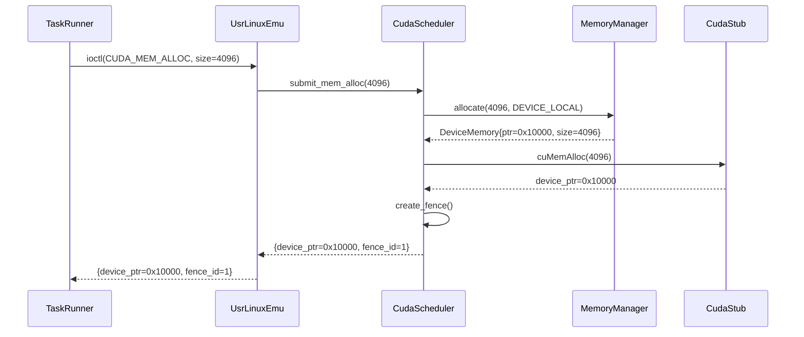
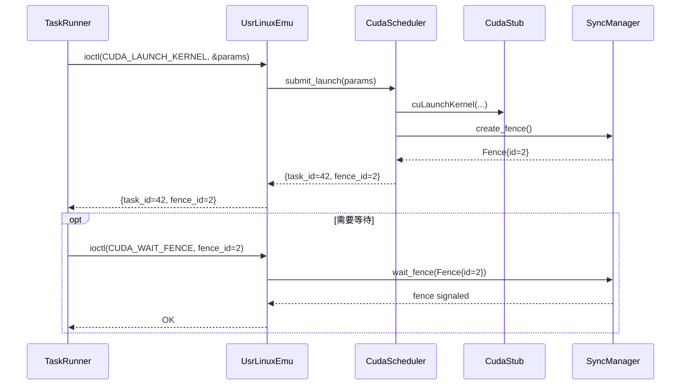
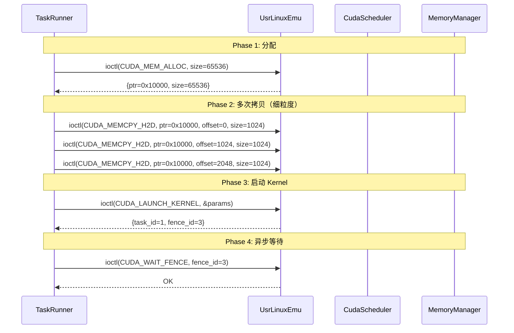

# DDS: CUDA/Vulkan Runtime 架构 v1.2-final

> **项目名称**: TaskRunner CUDA/Vulkan Runtime Compatibility Layer  
> **文档类型**: Detailed Design Specification (DDS)  
> **版本**: v1.2-final (整合版)  
> **状态**: ✅ 架构已批准，进入 Phase 1 实施  
> **最后更新**: 2026-04-07  
> **作者**: DevMate（技术合伙人）  
> **项目目录**: `/workspace/TaskRunner/`  
> **关联文档**: 
> - 架构提案：`cuda-vulkan-runtime-architecture.md`
> - 决策框架：`decision-frame-cuda-vulkan-runtime.md`
> - UsrLinuxEmu: `../UsrLinuxEmu/docs/architecture_design.md`

---

## 📋 目录

1. [架构决策汇总](#1-架构决策汇总)
2. [分阶段演进策略](#2-分阶段演进策略)
3. [系统架构](#3-系统架构)
4. [核心模块设计](#4-核心模块设计)
5. [ioctl 接口设计](#5-ioctl-接口设计)
6. [API 映射表](#6-api-映射表)
7. [关键流程序列图](#7-关键流程序列图)
8. [实施计划](#8-实施计划)
9. [测试策略](#9-测试策略)
10. [风险与缓解](#10-风险与缓解)

---

## 1. 架构决策汇总

### 1.1 已批准决策（CTO 签字确认）

| 决策 ID | 问题 | 批准方案 | 状态 |
|---------|------|---------|------|
| **D1** | 集成路径选择 | **B. 统一调度器模式** | ✅ 被 D5 替代 |
| **D2** | UsrLinuxEmu 接口扩展策略 | **C. 分层设计** | ✅ 有效 |
| **D3** | Barrier/Event 同步模型统一策略 | **A. 统一内部表示** | ✅ 被 D6 增强 |
| **D4** | 资源管理器层级划分 | **B. Runtime Stub 层独立追踪** | ✅ 有效 |
| **D5** | 调度器架构 | **独立调度器 + 统一接口** | ✅ 冻结 |
| **D6** | 同步原语设计 | **分层同步 (Barrier+Fence+Event)** | ✅ 冻结 |
| **D7** | ioctl 粒度 | **逐步细粒度** | ✅ 冻结 |
| **D8** | runtime-stub 依赖边界 | **完全独立** | ✅ 冻结 |
| **D9** | 演进策略 | **分阶段演进 (Phase 1 CUDA 专用)** | ✅ 冻结 |

### 1.2 架构原则

```
┌─────────────────────────────────────────────────────────────┐
│                    架构设计原则                              │
├─────────────────────────────────────────────────────────────┤
│ 1. 关注点分离：TaskRunner 管调度，Stub 管生命周期，Emu 管执行  │
│ 2. 独立调度器：CUDA/Vulkan 独立调度器 + 统一接口              │
│ 3. 分层设计：上层丰富命令语义，下层保持精简                   │
│ 4. 独立追踪：各 API 维护自己的资源 tracker                    │
│ 5. 分层同步：Barrier(任务级) + Fence(GPU 级) + Event(跨设备)  │
│ 6. 分阶段演进：Phase 1 CUDA 专用 → Phase 2 统一 GPU 接口      │
└─────────────────────────────────────────────────────────────┘
```

---

## 2. 分阶段演进策略

### 2.1 为什么分阶段？

**现状分析**：
- UsrLinuxEmu 已有 `include/usr_linux_emu/cuda_ioctl.h`（CUDA 专用接口）
- 统一 GPU 接口需要额外转译层，增加复杂度
- 快速验证 CUDA 端到端流程是首要目标

**演进路线**：

```
┌─────────────────────────────────────────────────────────────┐
│                    分阶段演进策略                            │
├─────────────────────────────────────────────────────────────┤
│                                                             │
│  Phase 1（现在）：CUDA 专用接口                               │
│  ├── 使用现有 cuda_ioctl.h                                  │
│  ├── 快速实现 CUDA Runtime MVP                              │
│  ├── 验证端到端流程（cudaMalloc → cudaLaunchKernel）         │
│  └── 交付物：vector_add kernel 端到端运行                   │
│                                                             │
│  Phase 2（未来）：统一 GPU 接口                              │
│  ├── 创建 gpu_ioctl.h（统一底层）                           │
│  ├── cuda_ioctl.h 转为上层转译层                            │
│  ├── 添加 vulkan_ioctl.h（与 cuda_ioctl 同层）              │
│  └── 交付物：CUDA-Vulkan 跨 API 内存共享                     │
│                                                             │
└─────────────────────────────────────────────────────────────┘
```

### 2.2 Phase 1 vs Phase 2 对比

| 维度 | Phase 1 (CUDA 专用) | Phase 2 (统一 GPU) |
|------|-------------------|-------------------|
| ioctl 接口 | `cuda_ioctl.h` | `gpu_ioctl.h` + 转译层 |
| 调度器 | CudaScheduler | CudaScheduler + VulkanScheduler |
| 命令类型 | CUDA 专用枚举 | 统一 DeviceCommand |
| 实施周期 | 4 周 MVP | +6 周扩展 |
| 代码复用 | 30% | 70%+ |
| Vulkan 支持 | ❌ | ✅ |
| 跨 API 互操作 | ❌ | ✅ |

### 2.3 本文档范围

**本 DDS v1.2 聚焦 Phase 1**：
- ✅ CUDA 专用 ioctl 接口（现有 `cuda_ioctl.h`）
- ✅ CudaScheduler 独立实现
- ✅ 分层同步原语（Fence/Barrier）
- ⏳ Vulkan 支持（Phase 2 扩展）

---

## 3. 系统架构

### 3.1 四层架构总览

```mermaid
graph TB
    subgraph Application_Layer["Application Layer"]
        A[CUDA App<br>vectorAdd.cu]
    end
    
    subgraph TaskRunner_Layer["TaskRunner Layer"]
        B[TaskRunner CLI<br>cuda_alloc/cuda_launch]
        C[CudaScheduler<br>独立调度器]
    end
    
    subgraph UsrLinuxEmu_Layer["UsrLinuxEmu Layer"]
        D[ioctl 转译层<br>compat_ioctl()]
        E[CudaStub<br>CUDA API 封装]
    end
    
    subgraph Hardware_Layer["Hardware Layer"]
        F[Native Driver<br>nvidia.ko]
        G[GPU Hardware]
    end
    
    A --> B
    B --> C
    C --> D
    D --> E
    E --> F
    F --> G
    
    classDef app fill:#e1f5ff,stroke:#0069d9,stroke-width:2px
    classDef taskrunner fill:#fff3e0,stroke:#ef6c00,stroke-width:2px
    classDef emu fill:#e8f5e9,stroke:#4caf50,stroke-width:2px
    classDef hw fill:#ffe0e0,stroke:#c62828,stroke-width:2px
    class Application_Layer app
    class TaskRunner_Layer taskrunner
    class UsrLinuxEmu_Layer emu
    class Hardware_Layer hw
```

### 3.2 数据流总览

```
┌─────────────┐    ┌─────────────┐    ┌─────────────┐    ┌─────────────┐
│  CUDA App   │    │  TaskRunner │    │ CudaScheduler│   │  CudaStub   │
│             │    │             │    │             │    │             │
│ cudaMalloc()│───▶│ cuda_alloc  │───▶│ submit_     │───▶│ cuMemAlloc()│
│             │    │             │    │ mem_alloc() │    │             │
└─────────────┘    └─────────────┘    └─────────────┘    └─────────────┘
                                                                 │
                                                                 ▼
┌─────────────┐    ┌─────────────┐    ┌─────────────┐    ┌─────────────┐
│  GPU        │    │  Native     │    │  ioctl()    │    │ UsrLinuxEmu │
│             │◀───│  Driver     │◀───│ CUDA_MEM_   │◀───│ compat_     │
│ execute()   │    │  nvidia.ko  │    │  ALLOC      │    │ ioctl()     │
└─────────────┘    └─────────────┘    └─────────────┘    └─────────────┘
```

---

## 4. 核心模块设计

### 4.1 CudaScheduler

**职责**: 接收 TaskRunner 命令，调度 CUDA 任务，管理同步原语

**核心接口**:
```cpp
// taskrunner/cuda_scheduler.hpp
#pragma once
#include "sync_primitives.hpp"
#include "memory_manager.hpp"
#include "cuda_stub.hpp"

namespace taskrunner {

class CudaScheduler {
public:
    explicit CudaScheduler(CudaStub* stub);
    
    // 内存管理（返回 fence_id 用于异步等待）
    struct AllocationResult {
        uint64_t device_ptr;
        uint64_t fence_id;
        int status;  // 0=success, -errno on error
    };
    AllocationResult submit_mem_alloc(size_t size);
    int submit_mem_free(uint64_t device_ptr);
    
    // 内存拷贝（细粒度，支持 offset）
    int submit_memcpy_h2d(uint64_t device_ptr, uint64_t offset,
                          const void* host_ptr, size_t size);
    int submit_memcpy_d2h(void* host_ptr, uint64_t device_ptr,
                          uint64_t offset, size_t size);
    
    // Kernel 启动
    struct LaunchResult {
        uint64_t task_id;
        uint64_t fence_id;
        int status;
    };
    LaunchResult submit_launch(const LaunchParams& params);
    
    // 同步
    int wait_fence(uint64_t fence_id, uint64_t timeout_ms = 0);
    int query_fence(uint64_t fence_id);
    
private:
    CudaStub* stub_;
    MemoryManager memory_mgr_;
    SyncManager sync_mgr_;
    std::map<uint64_t, Task> pending_tasks_;
    std::atomic<uint64_t> next_task_id_{1};
    std::atomic<uint64_t> next_fence_id_{1};
};

struct LaunchParams {
    const char* kernel_name;
    void* params;
    uint32_t grid_dim_x, grid_dim_y, grid_dim_z;
    uint32_t block_dim_x, block_dim_y, block_dim_z;
    uint32_t shared_mem_bytes;
};

struct Task {
    uint64_t task_id;
    uint64_t fence_id;
    enum class State { PENDING, RUNNING, COMPLETED, FAILED };
    State state;
    LaunchParams params;
};

} // namespace taskrunner
```

### 4.2 SyncManager（分层同步）

**职责**: 管理 Barrier/Fence/Event 三种同步原语

```cpp
// taskrunner/sync_primitives.hpp
#pragma once
#include <atomic>
#include <memory>
#include <mutex>
#include <condition_variable>

namespace taskrunner {
namespace sync {

// 任务级同步 - 用于 TaskRunner 等待任务完成
struct Barrier {
    uint64_t id;
    std::atomic<uint32_t> count;
    std::mutex mtx;
    std::condition_variable cv;
    bool signaled;
};

// GPU 级同步 - 对应 CUDA fence
struct Fence {
    uint64_t id;
    enum class State { UNSIGNALED, SIGNALED };
    std::atomic<State> state;
    void* native_handle;  // CUevent
};

// 跨设备同步 - 用于 CUDA-Vulkan 互操作（Phase 2）
struct Event {
    uint64_t id;
    std::chrono::steady_clock::time_point timestamp;
    void* native_handle;  // CUevent
};

class SyncManager {
public:
    // 创建同步原语
    std::shared_ptr<Barrier> create_barrier();
    std::shared_ptr<Fence> create_fence();
    std::shared_ptr<Event> create_event();
    
    // 信号操作
    void signal_barrier(const std::shared_ptr<Barrier>& b);
    void signal_fence(const std::shared_ptr<Fence>& f);
    
    // 等待操作
    void wait_barrier(const std::shared_ptr<Barrier>& b);
    int wait_fence(const std::shared_ptr<Fence>& f, uint64_t timeout_ms = 0);
    
    // 查询状态
    int query_fence(const std::shared_ptr<Fence>& f);
    
private:
    std::map<uint64_t, std::shared_ptr<Barrier>> barriers_;
    std::map<uint64_t, std::shared_ptr<Fence>> fences_;
    std::map<uint64_t, std::shared_ptr<Event>> events_;
    std::atomic<uint64_t> next_id_{1};
    std::mutex mutex_;
};

} // namespace sync
} // namespace taskrunner
```

### 4.3 MemoryManager

**职责**: 独立管理 GPU 内存资源

```cpp
// taskrunner/memory_manager.hpp
#pragma once
#include <map>
#include <mutex>

namespace taskrunner {

struct DeviceMemory {
    uint64_t device_ptr;
    size_t size;
    enum class MemoryType { HOST_VISIBLE, DEVICE_LOCAL, MANAGED };
    MemoryType type;
    void* host_ptr;  // HOST_VISIBLE 时有效
};

class MemoryManager {
public:
    DeviceMemory allocate(size_t size, 
                          DeviceMemory::MemoryType type = DeviceMemory::MemoryType::DEVICE_LOCAL);
    void free(DeviceMemory mem);
    
    // 拷贝操作（底层原语）
    void memcpy_h2d(DeviceMemory dst, const void* src, size_t size);
    void memcpy_d2h(void* dst, DeviceMemory src, size_t size);
    void memcpy_d2d(DeviceMemory dst, uint64_t dst_off,
                    DeviceMemory src, uint64_t src_off, size_t size);
    
private:
    std::map<uint64_t, DeviceMemory> allocations_;
    std::atomic<uint64_t> next_ptr_{0x10000};
    std::mutex mutex_;
};

} // namespace taskrunner
```

---

## 5. ioctl 接口设计

### 5.1 使用现有 cuda_ioctl.h

**文件路径**: `../UsrLinuxEmu/include/usr_linux_emu/cuda_ioctl.h`

** ioctl 命令定义**：

```cpp
#define CUDA_IOCTL_MAGIC 'C'

// 内存管理（细粒度）
#define CUDA_IOCTL_MEM_ALLOC      _IOWR(CUDA_IOCTL_MAGIC, 0x01, struct cuda_mem_alloc_request)
#define CUDA_IOCTL_MEM_FREE       _IOWR(CUDA_IOCTL_MAGIC, 0x02, struct cuda_mem_free_request)
#define CUDA_IOCTL_MEMCPY_H2D     _IOWR(CUDA_IOCTL_MAGIC, 0x03, struct cuda_memcpy_h2d_request)
#define CUDA_IOCTL_MEMCPY_D2H     _IOWR(CUDA_IOCTL_MAGIC, 0x04, struct cuda_memcpy_d2h_request)

// Kernel 启动
#define CUDA_IOCTL_LAUNCH_KERNEL  _IOWR(CUDA_IOCTL_MAGIC, 0x10, struct cuda_launch_kernel_request)

// 同步原语（分层）
#define CUDA_IOCTL_WAIT_FENCE     _IOWR(CUDA_IOCTL_MAGIC, 0x20, struct cuda_wait_fence_request)
#define CUDA_IOCTL_QUERY_FENCE    _IOWR(CUDA_IOCTL_MAGIC, 0x21, struct cuda_query_fence_request)

// Phase 2 预留（Graph/Batch）
#define CUDA_IOCTL_GRAPH_CREATE   _IOWR(CUDA_IOCTL_MAGIC, 0x30, struct cuda_graph_create_request)
#define CUDA_IOCTL_GRAPH_LAUNCH   _IOWR(CUDA_IOCTL_MAGIC, 0x31, struct cuda_graph_launch_request)
```

### 5.2 结构体定义

```cpp
// 内存管理
struct cuda_mem_alloc_request {
    uint64_t size;
    uint64_t device_ptr;  // out
    uint64_t fence_id;    // out
};

struct cuda_memcpy_h2d_request {
    uint64_t device_ptr;
    uint64_t offset;
    const void* host_ptr;
    uint64_t size;
    uint64_t fence_id;    // out
};

// Kernel 启动
struct cuda_launch_kernel_request {
    const char* kernel_name;
    void* params;
    uint32_t grid_dim_x, grid_dim_y, grid_dim_z;
    uint32_t block_dim_x, block_dim_y, block_dim_z;
    uint64_t task_id;   // out
    uint64_t fence_id;  // out
};

// 同步
struct cuda_wait_fence_request {
    uint64_t fence_id;
    uint64_t timeout_ms;  // 0 = infinite
};

struct cuda_query_fence_request {
    uint64_t fence_id;
    int32_t signaled;     // out: 1=signaled, 0=unsignaled
};
```

### 5.3 与 UsrLinuxEmu 接口关系

```
┌─────────────────────────────────────────────────────────────┐
│                    ioctl 分层设计                            │
├─────────────────────────────────────────────────────────────┤
│                                                             │
│  TaskRunner 层（丰富语义）                                   │
│  ├── cuda_alloc → CUDA_IOCTL_MEM_ALLOC                      │
│  ├── cuda_memcpy → CUDA_IOCTL_MEMCPY_H2D/D2H                │
│  ├── cuda_launch → CUDA_IOCTL_LAUNCH_KERNEL                 │
│  └── cuda_wait → CUDA_IOCTL_WAIT_FENCE                      │
│                                                             │
│  UsrLinuxEmu 层（转译 + 执行）                               │
│  ├── compat_ioctl() → 解析 cuda_ioctl 命令                   │
│  ├── 调用 CudaStub 对应 API                                  │
│  └── 返回结果（device_ptr/fence_id）                        │
│                                                             │
└─────────────────────────────────────────────────────────────┘
```

---

## 6. API 映射表

### 6.1 TaskRunner CLI → ioctl → CudaScheduler

| TaskRunner CLI | ioctl 命令 | CudaScheduler 方法 | 返回 |
|---------------|-----------|-------------------|------|
| `cuda_alloc <size>` | CUDA_IOCTL_MEM_ALLOC | submit_mem_alloc() | device_ptr, fence_id |
| `cuda_free <ptr>` | CUDA_IOCTL_MEM_FREE | submit_mem_free() | status |
| `cuda_memcpy_h2d <ptr> <offset> <file>` | CUDA_IOCTL_MEMCPY_H2D | submit_memcpy_h2d() | fence_id |
| `cuda_memcpy_d2h <file> <ptr> <offset>` | CUDA_IOCTL_MEMCPY_D2H | submit_memcpy_d2h() | fence_id |
| `cuda_launch <kernel> <grid> <block>` | CUDA_IOCTL_LAUNCH_KERNEL | submit_launch() | task_id, fence_id |
| `cuda_wait <fence_id>` | CUDA_IOCTL_WAIT_FENCE | wait_fence() | status |
| `cuda_query <fence_id>` | CUDA_IOCTL_QUERY_FENCE | query_fence() | signaled (0/1) |

---

## 7. 关键流程序列图

### 7.1 CUDA 内存分配流程



### 7.2 Kernel 启动流程（分层同步）



### 7.3 细粒度操作示例



---

## 8. 实施计划

### Phase 0: 文档定稿（2026-04-07）
- [x] DDS v1.0 框架创建
- [x] 架构评审（D1-D8 决策）
- [x] DDS v1.1 更新（独立调度器 + 分层同步 + 细粒度 ioctl）
- [x] DDS v1.2 整合（分阶段演进策略 D9）
- [x] **架构冻结签字**

### Phase 1: CUDA MVP（2026-04-10 ~ 2026-05-07）

| 周次 | 任务 | 交付物 | 验收标准 |
|------|------|--------|----------|
| **W1** | ioctl 接口确认 + UsrLinuxEmu 转译层 | compat_ioctl() 框架 | ioctl 命令可解析 |
| **W2** | CudaStub + MemoryManager 基础 | cuMemAlloc/cuMemcpy | 内存分配/拷贝可用 |
| **W3** | CudaScheduler + SyncManager | submit_launch + fence | Kernel 启动 + 同步 |
| **W4** | PoC 验证（vector_add） | 端到端测试 | alloc→copy→launch→wait |

### Phase 2: Vulkan 集成（2026-05-08 ~ 2026-06-15）
- [ ] VulkanStub 实现
- [ ] VulkanScheduler 实现
- [ ] 跨 API 互操作测试

### Phase 3: 高级特性（2026-06-16 ~ 2026-07-31）
- [ ] Graph/BATCH ioctl 实现
- [ ] 异步提交支持
- [ ] 性能优化

---

## 9. 测试策略

### 9.1 测试分类

| 类别 | 数量 | 覆盖率目标 | 执行频率 |
|------|------|-----------|----------|
| 单元测试 | 30+ | ≥80% | 每次提交 |
| 集成测试 | 15+ | ≥60% | 每日构建 |
| 端到端测试 | 5+ | 关键路径 | 每周 |
| 性能测试 | 3+ | N/A | 里程碑 |

### 9.2 关键测试用例

```cpp
// test_cuda_memory.cpp
TEST_CASE("cuda_mem_alloc and free", "[cuda][memory]") {
    CudaScheduler scheduler(stub);
    auto result = scheduler.submit_mem_alloc(4096);
    REQUIRE(result.status == 0);
    REQUIRE(result.device_ptr != 0);
    REQUIRE(scheduler.submit_mem_free(result.device_ptr) == 0);
}

// test_cuda_launch.cpp
TEST_CASE("cuda_launch_kernel vectorAdd", "[cuda][launch]") {
    CudaScheduler scheduler(stub);
    
    // 分配输入输出内存
    auto d_a = scheduler.submit_mem_alloc(N * sizeof(float));
    auto d_b = scheduler.submit_mem_alloc(N * sizeof(float));
    auto d_c = scheduler.submit_mem_alloc(N * sizeof(float));
    
    // 拷贝数据到 device
    scheduler.submit_memcpy_h2d(d_a.device_ptr, 0, host_a, N * sizeof(float));
    scheduler.submit_memcpy_h2d(d_b.device_ptr, 0, host_b, N * sizeof(float));
    
    // 启动 kernel
    LaunchParams params{.kernel_name="vectorAdd", .grid_dim_x=N/256, ...};
    auto launch_result = scheduler.submit_launch(params);
    REQUIRE(launch_result.status == 0);
    
    // 等待完成
    scheduler.wait_fence(launch_result.fence_id);
    
    // 拷贝结果回 host
    scheduler.submit_memcpy_d2h(host_c, d_c.device_ptr, 0, N * sizeof(float));
    
    // 验证结果
    for (int i = 0; i < N; i++) {
        REQUIRE(host_c[i] == host_a[i] + host_b[i]);
    }
}
```

---

## 10. 风险与缓解

| 风险 | 概率 | 影响 | 缓解措施 | 状态 |
|------|------|------|---------|------|
| GPFIFO 逆向失败 | 中 | 高 | 使用原生 CUDA Driver API | 🟡 |
| Vulkan 状态机复杂 | 高 | 中 | Phase 1 限定 compute | 🟡 |
| ioctl 性能瓶颈 | 中 | 中 | 细粒度接口 + 批处理 | 🟢 |
| 性能差距>10x | 低 | 低 | 定位"开发环境" | 🟢 |
| 独立调度器代码重复 | 中 | 低 | 提取公共基类 SchedulerBase | 🟢 |

---

## 附录：跨项目依赖

| 本项目 (TaskRunner) | 依赖项目 | 依赖内容 |
|---------------------|---------|----------|
| ioctl 命令定义 | `../UsrLinuxEmu` | `include/usr_linux_emu/cuda_ioctl.h` |
| ioctl 转译层 | `../UsrLinuxEmu` | `compat_ioctl()` 实现 |
| CUDA Driver API | NVIDIA CUDA SDK | `cuMemAlloc`/`cuLaunchKernel` |

---

## 架构决策记录

| 决策编号 | 决策内容 | 决策日期 | 状态 |
|---------|---------|---------|------|
| D1 | 集成路径：统一调度器 | 2026-04-07 | ✅ 被 D5 替代 |
| D2 | UsrLinuxEmu 接口：分层设计 | 2026-04-07 | ✅ 有效 |
| D3 | Barrier/Event：统一内部表示 | 2026-04-07 | ✅ 被 D6 增强 |
| D4 | 资源管理器：Runtime Stub 独立 | 2026-04-07 | ✅ 有效 |
| D5 | 调度器：独立调度器 + 统一接口 | 2026-04-07 | ✅ 冻结 |
| D6 | 同步：分层同步 (Barrier+Fence+Event) | 2026-04-07 | ✅ 冻结 |
| D7 | ioctl：逐步细粒度 | 2026-04-07 | ✅ 冻结 |
| D8 | runtime-stub：完全独立 | 2026-04-07 | ✅ 冻结 |
| D9 | 演进策略：分阶段 (Phase 1 CUDA 专用) | 2026-04-07 | ✅ 冻结 |

---

**架构冻结确认**:
- [x] CTO 批准：老板  日期：2026-04-07
- [x] DevMate 签字：DevMate  日期：2026-04-07

**下一步**: 
1. ✅ 架构冻结
2. ✅ 文档整合完成（v1.2-final）
3. 启动 Phase 1 Week 1：ioctl 接口确认 + UsrLinuxEmu 转译层

---

**文档位置**: `/workspace/TaskRunner/docs/DDS-CUDA-Vulkan-Runtime-v1.2-final.md`
