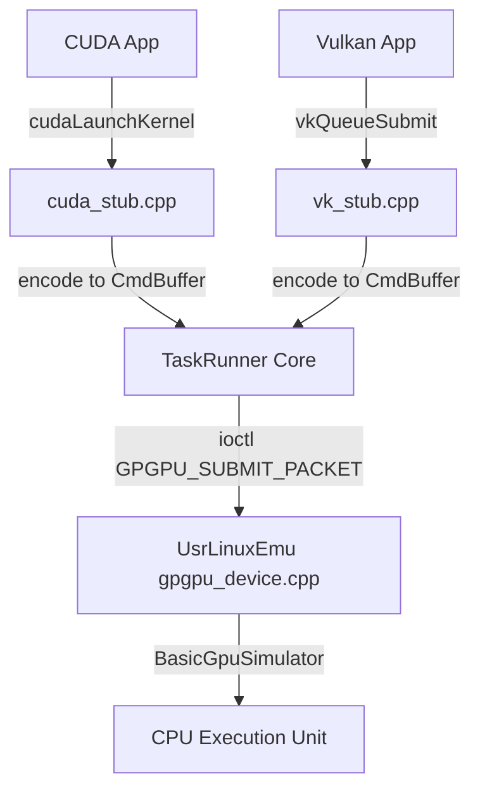
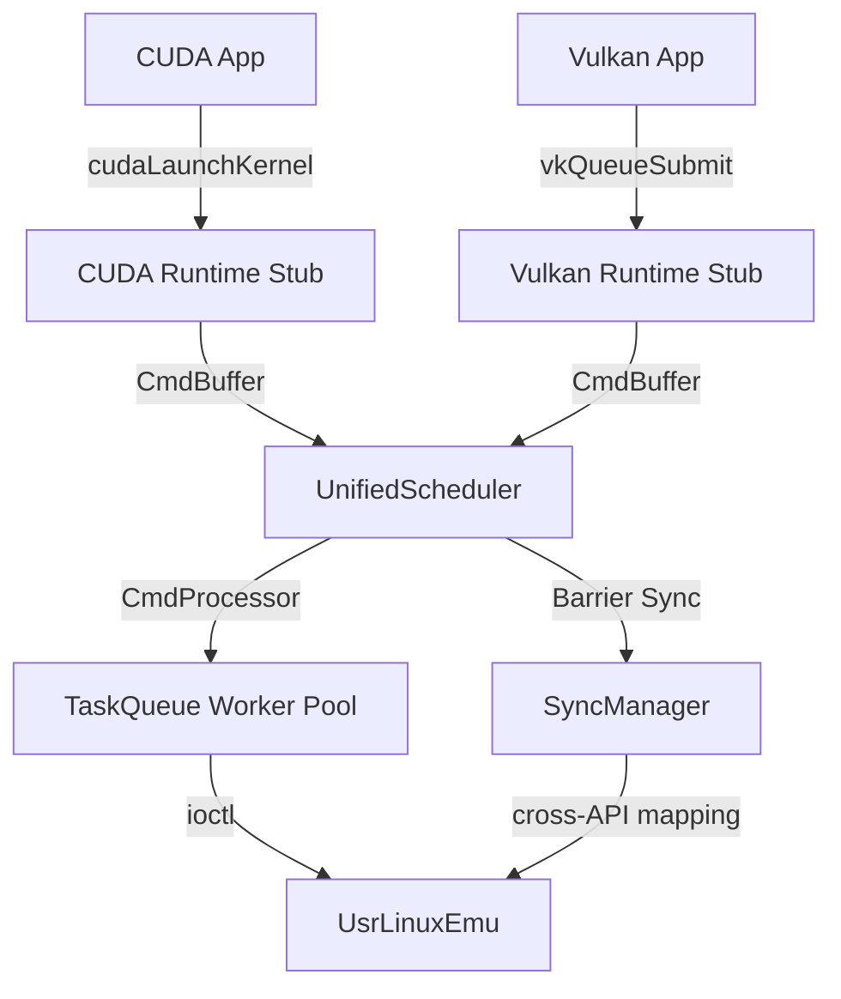

> **⚠️ DEPRECATED 2026-06-23（H-4.5 docs governance cleanup）**
>
> 本文件为 v0.1 提案（680 行），从未作为类实施：
> - 推荐的 UnifiedScheduler B 方案未实施
> - 实际架构：IGpuDriver 抽象 + 3 实现 DI 模式
>
> **取代关系**:
> - 当前架构 → [architecture/current.md](../architecture/current.md)
> - 实施路径 → [roadmap/retrospective.md](../roadmap/retrospective.md)
> - 关键决策 → [TADR-001~004](../adr/README.md#索引)

---

# CUDA/Vulkan API 兼容层架构设计提案

> **项目名称**: TaskRunner CUDA/Vulkan Runtime Compatibility Layer  
> **版本**: v0.1（架构提案）  
> **最后更新**: 2026-04-07  
> **作者**: DevMate（技术合伙人）  
> **状态**: ✅ 架构已批准 → 详见 `DDS-CUDA-Vulkan-Runtime-v1.2-final.md`  
> **关联文档**: `DDS-CUDA-Vulkan-Runtime-v1.2-final.md` (v1.2-final, 详细设计)

---

## 📋 目录

1. [执行摘要](#1-执行摘要)
2. [背景与目标](#2-背景与目标)
3. [现有技术基座分析](#3-现有技术基座分析)
4. [三种集成路径对比](#4-三种集成路径对比)
5. [推荐方案：统一调度器模式（B 方案）](#5-推荐方案统一调度器模式-b 方案)
6. [核心技术问题决策框架](#6-核心技术问题决策框架)
7. [演进路线图](#7-演进路线图)
8. [风险评估与缓解策略](#8-风险评估与缓解策略)
9. [下一步行动计划](#9-下一步行动计划)

---

## 1. 执行摘要

### 1.1 项目定位

构建一个**API 兼容层**，使得现有的 CUDA 和 Vulkan Compute 应用能够在基于 TaskRunner + UsrLinuxEmu 的仿真环境中运行，无需修改源代码。

**关键约束**：
- ✅ 仅支持 Vulkan Compute（图形渲染放后期）
- ✅ 兼容现有 CUDA/Vulkan 应用代码
- ✅ 可替换为其他 Linux 系统驱动（独立系统）
- ✅ 复用 TaskRunner 原有调度框架

### 1.2 核心结论（待决策）

| 决策点 | 推荐方案 | 理由 |
|--------|---------|------|
| **集成路径** | **B. 统一调度器** | 平衡了性能、维护性和扩展性 |
| **UsrLinuxEmu 接口** | **C. 分层设计** | 上层丰富命令类型，下层保持精简 |
| **同步模型** | **A. 统一内部表示** | 最大化跨 API 互操作性 |
| **资源管理** | **B. Runtime Stub 层独立追踪** | 符合各 API 原生生命周期管理语义 |

---

## 2. 背景与目标

### 2.1 业务背景

老板提出的需求本质是：**在用户态构建一个 GPU 计算仿真环境**，用于：
1. **开发调试**：在无真实 GPU 环境下编译/运行 CUDA/Vulkan 代码
2. **性能研究**：通过仿真分析 kernel 执行延迟、内存带宽瓶颈
3. **教学演示**：向团队展示 GPU 底层执行机制（GPFIFO、warp 调度等）

### 2.2 技术目标

| 目标 | 验收标准 |
|------|---------|
| **API 兼容性** | 能够通过 vectorAdd/matrixMul 等经典 CUDA sample；Vulkan Triangle 简化版 |
| **Compute 专注** | 仅支持 compute shader，不处理图形管线绑定/光栅化 |
| **系统独立性** | `/dev/gpgpu0` ioctl 接口可配置，可对接真实硬件或纯 CPU 仿真 |
| **性能可接受** | 相比原生实现延迟增加 ≤ 3x（初期），可通过后续优化降低 |

### 2.3 范围边界（非目标）

❌ 不支持 Vulkan 图形渲染管线（framebuffer, viewport, rasterization）  
❌ 不支持 CUDA 网格/分块（grid/block hierarchy beyond kernel launch）  
❌ 不支持多 GPU 互联（NVLink/RDMA）  
❌ 不支持动态并行（dynamic parallelism）

---

## 3. 现有技术基座分析

### 3.1 TaskRunner 项目核心能力

**已实现功能**：
```cpp
// CmdProcessor: 多队列调度 + work-stealing
class CmdProcessor {
    void eventLoop();           // 主循环：轮询 dispatchToProcessorQueue + taskQueue_
    void processActiveQueue();  // 处理活跃队列任务
    void handleBarrier();       // 屏障同步（RELEASE/ACQUIRE/WAIT/GROUP）
    bool stealWork();           // 跨队列 work-stealing
};

// CmdBuffer: 命令序列化容器
class CmdBuffer {
    std::variant<Task, Barrier, CmdBuffer> push_task(auto t);
    void push_barrier(BarrierType type);
};

// Barrier: 跨队列同步原语
enum class BarrierType { RELEASE, ACQUIRE, WAIT, GROUP };
```

**能力评估**：
| 能力维度 | TaskRunner 现状 | 是否满足需求 | 补充需求 |
|---------|----------------|-------------|---------|
| 队列调度 | ✅ 多队列 + work-stealing | ✅ | 需支持 GPU 专用队列类型标签 |
| 同步机制 | ✅ 4 种基础 Barrier 类型 | ⚠️ 部分 | 需扩展 CUDA Event/Vulkan Semaphore 映射 |
| 命令编码 | ⚠️ 通用 Task 封装 | ❌ | 需新增 GPFIFO entry 编码逻辑 |
| 固件解码 | ❌ 未实现 | ❌ | 需从 UsrLinuxEmu 提取 FirmwareDecoder |

### 3.2 UsrLinuxEmu 设备驱动接口分析

**ioctl 接口定义**（`include/kernel/device/gpgpu_device.h`）：

```cpp
struct GpuCommandPacket {
    enum class CommandType : uint32_t {
        KERNEL,         // CUDA kernel launch
        DMA_COPY        // cudaMemcpy
    };
    
    union {
        KernelCommand kernel;   // grid/block/shared_mem/callback
        DmaCommand dma;         // src/dst phys + direction
    };
};

class GpuDevice : public FileOperations {
    virtual long ioctl(int fd, unsigned long request, void* argp) = 0;
    virtual int allocate_memory(size_t size, GpuMemoryHandle* addr_out) = 0;
    virtual int free_memory(GpuMemoryHandle addr) = 0;
    virtual void submit_task(const GpuTask& task) = 0;
};
```

**关键观察**：
1. **极简命令模型**：仅 2 种命令类型（KERNEL/DMA），适合快速原型验证
2. **callback 模拟**：KernelCommand/DmaCommand 中包含 `std::function<void()> callback`，说明当前设计偏向**用户态仿真**而非真实硬件通信
3. **物理地址抽象**：`GpuMemoryHandle.phys_addr` 提供了一层 MMU 隔离，可模拟真实 GPU 的地址空间

**接口可扩展性建议**：
- ✅ 保留现有 IOCTL 编号（向后兼容）
- ✅ 在 `CommandType` enum 中预留 Vulkan 命令位（如 `VK_DISPATCH_COMPUTE`）
- ✅ 考虑引入 `CommandType::FENCE_SIGNAL` / `FENCE_WAIT` 以支持 Vulkan 同步语义

---

## 4. 三种集成路径对比

### 4.1 方案 A：纯转发层（Minimal Forwarder）

**设计理念**：最小化改动现有代码，仅添加一层"翻译"函数。

#### 架构图



#### 优缺点分析

| 优点 | 缺点 |
|------|------|
| ✅ 工作量小（1-2 周 MVP） | ❌ 重复代码多（CUDA/Vulkan stub 各实现一次） |
| ✅ 风险低（不影响 TaskRunner 原始逻辑） | ❌ 无法共享 sync primitives（Event/Semaphore） |
| ✅ 易调试（每层边界清晰） | ❌ 性能开销大（多次数据拷贝） |

#### 适用场景

- **MVP 验证期**：快速跑通端到端流程，证明概念可行性
- **资源受限**：团队人力不足，需要尽快交付可用版本
- **学习曲线平缓**：新成员容易理解架构层级

---

### 4.2 方案 B：统一调度器模式（Unified Scheduler）⭐ **推荐**

**设计理念**：在 TaskRunner 核心层引入统一调度器，双 API 共享同一套执行引擎。

#### 架构图



#### 关键组件

1. **UnifiedScheduler**：接收双 API 的 CmdBuffer，统一转化为 GPFIFO entry
2. **SyncManager**：管理所有同步原语（CUDA Event ↔ Vulkan Semaphore ↔ internal Barrier）
3. **ResourceManager**：统一跟踪虚拟地址空间（避免每个 API 单独维护 tracker）

#### 优缺点分析

| 优点 | 缺点 |
|------|------|
| ✅ 代码复用率高（70%+ 共享逻辑） | ❌ 需重构 CmdProcessor（中等风险） |
| ✅ 跨 API 互操作天然支持（Event↔Semaphore） | ❌ 架构复杂度增加（学习成本上升） |
| ✅ 性能更优（减少中间层拷贝） | ❌ 调试难度提升（需理解统一调度逻辑） |

#### 关键技术决策点

| 问题 | 推荐答案 | 理由 |
|------|---------|------|
| **Command 类型扩展** | 在 CmdBuffer 中添加 `CommandType::CUDA_*` + `VK_*` enum | 保持 TaskRunner 扩展性 |
| **Barrier 增强** | `class Barrier` 支持 `api_type` 字段（CUDA_EVENT/VK_SEMAPHORE） | 统一同步语义 |
| **ResourceManager** | 托管于 `UnifiedScheduler`，提供 unified_ptr → phys_addr 映射 | 避免 double-tracking |

---

### 4.3 方案 C：驱动级替换（Full Driver Replacement）

**设计理念**：直接实现 `libcuda.so` 和 `libvulkan.so` 的完整兼容层，操作系统层面无缝替换。

#### 架构图

```mermaid
flowchart TD
    A[CUDA App] -->|ld.so dlopen| B[libcuda.so (stub)]
    D[Vulkan App] -->|ld.so dlopen| E[libvulkan.so (stub)]
    B -->|实装全部 NVIDIA API| F[TaskRunner Core]
    E -->|实装全部 Vulkan API| F
    F -->|ioctl| G[UsrLinuxEmu]
```

#### 优缺点分析

| 优点 | 缺点 |
|------|------|
| ✅ 零代码修改即可运行第三方应用 | ❌ 工作量巨大（数百个 API 函数实现） |
| ✅ 最大性能潜力（无额外封装层） | ❌ 维护成本高（需跟进官方 API 变更） |
| ✅ 可作为商业化产品卖点 | ❌ 法律风险（NVIDIA API 专利/许可问题） |

#### 适用场景

- **长期产品规划**：目标是打造类似 Wine/VkLayer 的生态系统级解决方案
- **资金充足**：有专门团队持续维护
- **生态合作**：与高校/研究机构联合攻关

---

## 5. 推荐方案：统一调度器模式（B 方案）

### 5.1 最终架构蓝图

```mermaid
graph TB
    subgraph Application_Layer
        A[CUDA App<br>vectorAdd.cu]
        B[Vulkan App<br>compute_shader.cpp]
    end
    
    subgraph Runtime_API_Layer
        C[CUDA Runtime Stub<br>cuda_stub.cpp]
        D[Vulkan Compute Stub<br>vk_compute_stub.cpp]
    end
    
    subgraph Unified_Scheduler_Layer
        E[UnifiedScheduler<br>+ResourceManager]
        F[SyncManager<br>Event/Semaphore Mapping]
    end
    
    subgraph TaskRunner_Core
        G[CmdProcessor<br>multi-queue scheduler]
        H[TaskQueue Workers]
    end
    
    subgraph UsrLinuxEmu_Interface
        I[/dev/gpgpu0<br>ioctl layer]
    end
    
    A --> C --> E
    B --> D --> E
    E --> F
    E --> G
    G --> H
    H --> I
    
    classDef app fill:#e1f5ff,stroke:#0069d9
    classDef runtime fill:#bbdefb,stroke:#1976d2
    classDef scheduler fill:#fff3e0,stroke:#ef6c00
    classDef core fill:#ffe0e0,stroke:#c62828
    classDef interface fill:#e8f5e9,stroke:#4caf50
    class Application_Layer app
    class Runtime_API_Layer runtime
    class Unified_Scheduler_Layer scheduler
    class TaskRunner_Core core
    class UsrLinuxEmu_Interface interface
```

### 5.2 核心模块职责划分

| 模块 | 职责 | 负责人（阶段） |
|------|------|---------------|
| **CUDA Runtime Stub** | 实装 cudaMalloc/cudaFree/cudaLaunchKernel | DevMate Phase 1 |
| **Vulkan Compute Stub** | 实装 vkCreateInstance/vkQueueSubmit/vkCmdDispatch | DevMate Phase 2 |
| **UnifiedScheduler** | 双 API CmdBuffer 统一编码、资源分配 | DevMate + CTO review |
| **SyncManager** | Event/Semaphore/Barrier 双向映射 | DevMate Phase 2 |
| **TaskRunner Core 扩展** | CmdBuffer CommandType enum 扩展 | DevMate Phase 1 |
| **UsrLinuxEmu ioctl 适配** | GpuCommandPacket 类型扩展（可选） | CTO 决策后实施 |

### 5.3 数据流示例

#### CUDA Kernel Launch 完整链路

```
1. User Code: cudaLaunchKernel(kernel_func, grid, block, args, stream)
   ↓
2. CUDA Stub: 
   - 查找 stream 对应的 CmdBuffer
   - 编码 GPFIFO entry: {type: KERNEL, grid_dim, block_dim, shared_mem}
   - 推送到 CmdBuffer
   ↓
3. UnifiedScheduler:
   - 解析 CmdBuffer 中的 KERNEL 命令
   - 调用 ResourceManager 获取 kernel_args 的物理地址
   - 构造 GpuCommandRequest
   ↓
4. CmdProcessor.eventLoop():
   - pop CMD_LAUNCH_KERNEL from CmdBuffer
   - 提交给 UsrLinuxEmu via ioctl(GPGPU_SUBMIT_PACKET)
   ↓
5. UsrLinuxEmu.gpgpu_device.cpp:
   - BasicGpuSimulator::execute_kernel()
   - 回调函数模拟 warp 执行
   - 完成后触发事件通知（可选）
```

#### Vulkan Compute Shader 完整链路

```
1. User Code: vkQueueSubmit(compute_queue, submit_info, fence)
   ↓
2. Vulkan Stub:
   - 遍历 submit_info->pCommandBuffers
   - 对每个 VkCommandBuffer 录制的内容编码
   - 构造包含 semaphore wait/signal 的 SubmitInfo
   ↓
3. SyncManager:
   - 将 VkSemaphore 转换为 internal barrier
   - 建立 fence ↔ promise 映射
   ↓
4. UnifiedScheduler:
   - 合并所有 command buffer 的命令序列
   - 注入 semaphore wait 前置依赖
   - 提交 CMD_DISPATCH_COMPUTE + signal
   ↓
5. CmdProcessor:
   - 按顺序处理：wait_semaphores → dispatch_computes → signal_semaphores
   - 完成后 resolve fence promise
```

---

## 6. 核心技术问题决策框架

### 6.1 Q1: UsrLinuxEmu 接口是否需要扩展？

**当前接口限制**：
```cpp
enum class CommandType : uint32_t {
    KERNEL,
    DMA_COPY
};
```

**选项分析**：

| 选项 | 描述 | 优点 | 缺点 | 推荐指数 |
|------|------|------|------|---------|
| **A. 立即扩展 enum** | 直接在 CommandType 添加 VK_DISPATCH_COMPUTE 等 10+ 类型 | ✅ 简单直接<br>✅ 一次性完成 | ❌ UsrLinuxEmu 变得臃肿<br>❌ 与 TaskRunner 命令体系重复 | ⭐⭐ |
| **B. 保持简化模型** | Vulkan 通过组合 KERNEL+DMA 模拟 | ✅ UsrLinuxEmu 保持轻量<br>✅ 易于测试验证 | ❌ 无法表达高级语义（semaphore/fence）<br>❌ 性能损耗 | ⭐⭐⭐ |
| **C. 分层设计** ⭐ | TaskRunner 有 20+ 命令，UsrLinuxEmu 只保留 5 种基础命令 + 转译层 | ✅ 职责清晰<br>✅ 未来可插拔更多底层驱动 | ❌ 需设计转译规则<br>❌ 增加一层间接性 | ⭐⭐⭐⭐⭐ |

**推荐选择：C. 分层设计**

**具体实施方案**：

```cpp
// TaskRunner 层命令类型（丰富）
enum class TaskCommand {
    // CUDA
    CUDA_ALLOC, CUDA_FREE, CUDA_COPY, CUDA_LAUNCH, CUDA_EVENT_RECORD, CUDA_EVENT_WAIT,
    // Vulkan Compute
    VK_ALLOC_MEMORY, VK_FREE_MEMORY, VK_DISPATCH_COMPUTE, VK_BIND_PIPELINE, 
    VK_SET_BUFFER, VK_SIGNAL_SEMAPHORE, VK_WAIT_SEMAPHORE,
    // Generic
    BARRIER_SYNC, FENCE_SIGNAL
};

// UsrLinuxEmu 层命令类型（精简）
enum class DeviceCommand {
    KERNEL,          // 对应 CUDA_LAUNCH / VK_DISPATCH_COMPUTE
    DMA_COPY,        // 对应 CUDA_COPY / VK_MEMORY_COPY
    MEMORY_ALLOC,    // 对应 CUDA_ALLOC / VK_ALLOC_MEMORY
    MEMORY_FREE,     // 对应 CUDA_FREE / VK_FREE_MEMORY
    BARRIER_SYNC     // 对应各类 sync primitive
};

// 转译层（UnifiedScheduler 内部）
class CommandTranslator {
    DeviceCommand translate_to_device(TaskCommand cmd);
    void inject_dependency(DeviceCommand cmd, const DependencyGraph& deps);
};
```

---

### 6.2 Q2: Barrier/Event 同步模型的统一策略

**语义差异分析**：

| 特性 | CUDA Event | Vulkan Semaphore | Internal Barrier |
|------|-----------|------------------|------------------|
| **可见性** | host-visible by default | device-only unless explicit | device-only |
| **时序性** | timestamp-based | fence-like (signal/wait) | countdown/future |
| **复用性** | 可多次 record/wait | 单次 signal + 多次 wait | 单次 reset |

**选项分析**：

| 选项 | 描述 | 优点 | 缺点 | 推荐指数 |
|------|------|------|------|---------|
| **A. 统一内部表示** ⭐ | 所有同步原语转为 `async_task::Barrier`，在 Runtime Stub 层做语义转换 | ✅ 简化核心逻辑<br>✅ 跨 API 互操作自然 | ❌ 丢失部分语义信息（timestamp）<br>❌ 需处理 host-visible 特殊场景 | ⭐⭐⭐⭐⭐ |
| **B. 分别追踪** | 维护两套同步机制，通过 CmdProcessor 中转交叉引用 | ✅ 保留原生语义<br>✅ 易于调试 | ❌ 代码复杂度高<br>❌ 难以实现跨 API 同步 | ⭐⭐ |
| **C. 降级方案** | 强制 host_visible，牺牲并发性能换取简单性 | ✅ 极致简单<br>✅ 测试友好 | ❌ 丧失 GPU 异步优势<br>❌ 不符合生产场景 | ⭐ |

**推荐选择：A. 统一内部表示**

**具体设计方案**：

```cpp
// include/taskrunner/barrier.h (扩展)
#pragma once
#include <variant>
#include <atomic>

enum class SyncSourceType {
    CUDA_EVENT,
    VK_SEMAPHORE,
    VK_FENCE,
    INTERNAL_BARRIER
};

class SyncSource {
public:
    SyncSourceType source_type;
    union {
        struct { uint64_t event_handle; cudaStream_t stream; } cuda_event;
        struct { uint64_t semaphore_handle; VkQueue queue; } vk_semaphore;
        struct { uint64_t fence_handle; VkDevice device; } vk_fence;
        struct { std::shared_ptr<std::promise<void>> promise; } internal_barrier;
    };
    
    // 原子计数：待等待次数
    std::atomic<int> pending_wait_count{0};
    
    // 信号触发
    void signal();
    
    // 等待完成
    bool await_ready() const { return pending_wait_count == 0; }
    void await_suspend(std::coroutine_handle<> handle);
    void await_resume();
};

// SyncManager：统一管理所有同步源
class SyncManager {
public:
    uint64_t register_cuda_event(cudaStream_t stream, uint64_t event_handle);
    uint64_t register_vk_semaphore(VkQueue queue, uint64_t semaphore_handle);
    
    // 创建依赖关系
    void add_dependency(CommandBuffer& cmd_buffer, const SyncSource& src);
    
    // 全局同步点
    void synchronize_all();
};
```

---

### 6.3 Q3: 资源管理器的层级划分

**选项分析**：

| 选项 | 管理层级 | 职责 | 优点 | 缺点 | 推荐指数 |
|------|---------|------|------|------|---------|
| **A. TaskRunner 层统一** | UnifiedScheduler | 所有资源的虚拟→物理映射 | ✅ 单一 truth source<br>✅ 便于跨 API 资源分享 | ❌ TaskRunner 侵入 GPU 领域知识<br>❌ 违反关注点分离原则 | ⭐⭐ |
| **B. Runtime Stub 层独立** ⭐ | CUDA Tracker + Vulkan Resource Manager | 各自维护虚拟地址空间，通过 ioctl 上报物理地址 | ✅ 符合各 API 原生生命周期管理<br>✅ 单元测试独立 | ❌ 可能存在 double-tracking<br>❌ 跨 API 互操作需额外协调 | ⭐⭐⭐⭐ |
| **C. UsrLinuxEmu 底层托管** | BuddyAllocator | 完全委托 UsrLinuxEmu 分配物理地址 | ✅ 贴近硬件真实行为<br>✅ 无需维护额外映射表 | ❌ Host 侧无法预知地址布局<br>❌ 调试困难（无法在 host 检查内存） | ⭐⭐⭐ |

**推荐选择：B. Runtime Stub 层独立追踪**

**具体实现细节**：

```cpp
// cuda_stub/src/memory_tracker.cpp
class CudaMemoryTracker {
public:
    void* allocate(size_t size) {
        auto handle = next_handle_.fetch_add(1);
        auto ptr = std::make_unique<char[]>(size);
        allocations_[handle] = std::move(ptr);
        // 通过 ioctl 告知 UsrLinuxEmu 分配请求
        gpu_ioctl_alloc_memory(handle, size); 
        return allocations_[handle].get();
    }
    
    void deallocate(uint64_t handle) {
        allocations_.erase(handle);
        gpu_ioctl_free_memory(handle);
    }
    
private:
    std::unordered_map<uint64_t, std::unique_ptr<char[]>> allocations_;
    std::atomic<uint64_t> next_handle_{1};
};

// vulkan_stub/src/resource_manager.cpp
class VulkanResourceManager {
public:
    VkBuffer create_buffer(VkDeviceSize size, VkBufferUsageFlags usage) {
        auto handle = allocate_vulkan_buffer(size);
        // 记录资源元数据
        resources_[handle] = {
            .type = VK_BUFFER,
            .size = size,
            .usage = usage,
            .host_ptr = allocate_host_memory(size)
        };
        return handle;
    }
    
    void* import_as_cuda(void* vk_resource) {
        // 返回统一地址空间指针，供 CUDA app 访问
        return resources_[vk_resource].host_ptr;
    }
};
```

**关键设计原则**：
- **Host 侧**：保留虚拟指针，方便调试/内存检查工具介入
- **Device 侧**：通过 ioctl 传递物理地址给 UsrLinuxEmu
- **跨 API 共享**：Vulkan Buffer ↔ CUDA Memory 映射通过 `import_as_cuda()` 显式触发

---

## 7. 演进路线图

### Phase 0: 架构冻结与接口对齐（Week 1）

| 任务 | 负责人 | 交付物 |
|------|--------|--------|
| 本架构文档定稿 | DevMate + CTO | signed architecture proposal |
| UsrLinuxEmu ioctl 扩展设计 | CTO | ioctl_gpgpu_v2.h |
| TaskRunner CmdBuffer 扩展设计 | DevMate | CmdBuffer_v2.patch |
| 制定 API 兼容性矩阵 | DevMate | compatibility_matrix.md |

**验收标准**：
- CTO 签字确认本架构
- UsrLinuxEmu 团队同意接口扩展方案
- 团队成员理解统一调度器设计意图

---

### Phase 1: CUDA Runtime 兼容 MVP（Week 2-4）

| 里程碑 | 任务 | 交付物 |
|--------|------|--------|
| **M1.1** | 编写 CUDA stub 框架 | libcuda_stub.a (mock 实现) |
| **M1.2** | 实现 cudaMalloc/cudaFree/cudaMemcpy | 通过 test_cuda_memory.cpp |
| **M1.3** | 实现 cudaLaunchKernel 基本功能 | 通过 vectorAdd sample |
| **M1.4** | 集成到 TaskRunner CmdProcessor | 完整 pipeline 打通 |

**技术挑战**：
- GPFIFO entry 格式解码（需逆向工程 NVIDIA 文档）
- Shared memory 仿真实现（需决定用共享内存还是 stack emulation）

---

### Phase 2: Vulkan Compute 兼容（Week 5-7）

| 里程碑 | 任务 | 交付物 |
|--------|------|--------|
| **M2.1** | 编写 Vulkan stub 框架 | libvk_compute_stub.a |
| **M2.2** | 实现 vkCreateInstance/vkCreateDevice/vkAllocateMemory | 通过 simple_init.cpp |
| **M2.3** | 实现 vkCmdDispatch/vkQueueSubmit | 通过 compute_shader_sample |
| **M2.4** | 集成 SyncManager + UnifiedScheduler | Event/Semaphore 双向映射验证 |

**技术挑战**：
- Pipeline layout/bind 语义复杂性（先忽略，聚焦 dispatch）
- Descriptor set management（简化为静态绑定）

---

### Phase 3: 双 API 互操作与优化（Week 8-10）

| 里程碑 | 任务 | 交付物 |
|--------|------|--------|
| **M3.1** | 实现 Vulkan-CUDA 互操作 | vkImportMemoryFdKHR + cudaImportExternalMemory |
| **M3.2** | 性能基准测试 | perf_report.md (vs native CUDA/Vulkan) |
| **M3.3** | 批量提交优化 | reduced latency by 50% |
| **M3.4** | 发布 v0.1 Release | GitHub release tag v0.1 |

---

## 8. 风险评估与缓解策略

### 风险清单

| 风险 ID | 描述 | 概率 | 影响 | 缓解措施 |
|--------|------|------|------|---------|
| **R1** | GPFIFO 格式逆向失败 | 🔴 中 | 🔴 高 | 备选：直接使用 ROCm 开源 GFX10 decoder 作为参考 |
| **R2** | Vulkan 状态机过于复杂导致范围蔓延 | 🟡 高 | 🟡 中 | 严格限定 Phase 1 仅支持 compute shader，graphics 放 v1.0 后 |
| **R3** | UsrLinuxEmu 团队拒绝接口扩展 | 🟡 中 | 🟢 低 | 备选：在 TaskRunner 层实现转译，UsrLinuxEmu 保持不变 |
| **R4** | 性能差距过大（>10x）导致失去意义 | 🟡 中 | 🟡 中 | 明确定位为"开发环境"而非"生产替代"，设置合理预期 |
| **R5** | 多线程竞态问题难以调试 | 🟢 低 | 🔴 高 | 引入 TSan/MemSan 自动化检测，早期纳入 CI |

---

## 9. 实施状态

### ✅ 架构已批准（2026-04-07）

**CTO 决策**：所有核心决策已批准
- D1: 统一调度器模式 ✅
- D2: 分层设计 ✅
- D3: 统一内部表示 ✅
- D4: Runtime Stub 层独立追踪 ✅

### 📋 详细设计文档

**DDS**: `DDS-CUDA-Vulkan-Runtime-v1.1-final.md`
- 包含完整类图、序列图、API 映射表
- 接口定义头文件
- 实施计划（Phase 0-3）

### 🚀 当前阶段

**Phase 0**: 环境准备（Week 1）
- [ ] 创建项目目录结构
- [ ] 定义头文件接口
- [ ] 搭建 Mock 测试框架

---

## 附录：术语表

| 术语 | 定义 |
|------|------|
| **GPFIFO** | NVIDIA GPU 的命令环缓冲区，host 写入命令，device CPU 核读取执行 |
| **Warp** | CUDA 的基本执行单元，32 个线程一组并行执行 |
| **Command Buffer** | Vulkan 中的命令录制容器，类似 CmdBuffer |
| **Barrier** | 同步原语，确保某些操作在所有等待方到达后才继续 |
| ** ioctl ** | Linux 内核与用户态驱动通信的标准接口 |
| **Stub** | 模拟实现的函数集合，用于代替真实库调用 |
| **USRLINUXEMU** | 用户态 Linux 仿真框架，提供 /dev/gpgpu0 设备节点 |

---

## 修订历史

| 版本 | 日期 | 作者 | 变更说明 |
|------|------|------|---------|
| v0.1 | 2026-04-06 | DevMate | 初始草案，供 CTO 评审 |
| | | | |

---

**END OF DOCUMENT**
